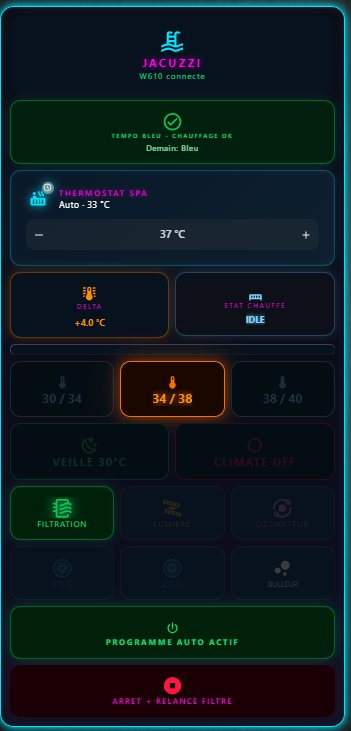
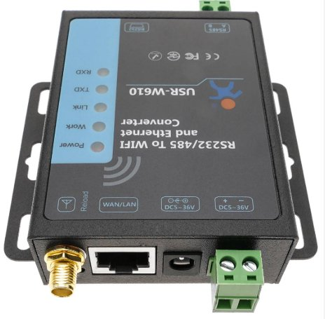

<div align="center">


# Joyonway P23B32 Spa for Home Assistant

**Native local integration for the Joyonway P23B32 spa controller via RS485 over a USR-W610 WiFi bridge.**

[](https://github.com/hacs/integration)
[](https://github.com/KnapTheBuilder/ha-joyonway-p23b32/releases)
[](LICENSE)
[](https://www.home-assistant.io)

[English](#english) · [Français](#français)

</div>

---

<a name="english"></a>

# English

[Features](#features) · [Install](#installation) · [Hardware](#hardware) · [Config](#configuration) · [Entities](#entities) · [Automations](#automation-examples) · [Protocol](#protocol-details) · [Roadmap](#roadmap) · [Credits](#credits)

## Overview

This integration brings full Home Assistant control over the **Joyonway P23B32** spa controller. Communication is purely local via RS485, bridged to your network through a **USR-W610** WiFi-to-serial adapter in TCP server mode. No cloud, no Joyonway app, no internet required.

All commands have been reverse-engineered from RS485 captures and physically validated on a real P23B32 unit.

> **Discussion thread on HA Community:** [JoyOnWay Spa Control](https://community.home-assistant.io/t/joyonway-spa-control/582344)

<div align="center">

</div>

## Features

- **Fully local control**, no cloud dependency, no internet required
- **Native switches** for light, blower, left jets and right jets (two-way state, mirrored from the controller broadcast)
- **Native climate entity** (thermostat) for setpoint control, 15.5 to 40 C, 0.5 C step
- **Real-time monitoring** of water temperature, setpoint, all pumps, blower, light, heater demand
- **One-shot buttons** for filtration and an "All OFF" emergency stop
- **Connectivity sensor** to detect when the W610 bridge is offline
- **Native HA device**, all entities grouped under one logical device with manufacturer info
- **English and French** UI translations included
- **HACS validated**, custom repository install

## Hardware

### Joyonway P23B32 control panel

The PB554 control panel on the spa rim. The integration reads the broadcast frames emitted by this controller on the RS485 bus, then injects commands to toggle the same outputs (pumps, blower, light, filtration).

### Joyonway P23B32 control panel

<div align="center">

</div>

The PB554 control panel on the spa rim. The integration reads the broadcast frames emitted by this controller and injects commands to toggle the same outputs.

### USR-W610 RS485 to WiFi bridge

<div align="center">

</div>

The USR-W610 is an industrial RS232/RS485 to WiFi and Ethernet converter. Powered in 5-30V DC, configured in TCP Server mode at 38400 8N1, it exposes the spa's RS485 bus as a TCP socket reachable by Home Assistant.

> **W610 stability tip.** Set TCP timeout to 30 s (not the 300 s default) and limit MAX TCP connections to 1. The default settings cause zombie sockets to accumulate and trigger cyclic disconnections, since the W610 accepts only one TCP client at a time.

## Requirements

| Item | Details |
| --- | --- |
| Spa controller | Joyonway P23B32 (physically validated, other models may need protocol adaptation) |
| RS485 bridge | USR-W610 (WiFi, TCP Server mode, port 8899, 38400 8N1) |
| Home Assistant | 2024.1.0 or later |
| Network | HA and W610 on the same LAN, no internet required |

## Hardware wiring

> **Warning.** Opening the spa electrical enclosure exposes you to mains voltage. Always cut the power at the breaker before any intervention. If you are not comfortable with electrical work, hire a qualified electrician.

The USR-W610 connects to the RS485 bus inside the spa controller box:

```
Joyonway P23B32 RS485 bus
+--------+--------+
|   A    |   B    |
+---|----+---|----+
    |        |
+---v----+---v----+
|   A    |   B    |   USR-W610
+--------+--------+   (5-30V DC, TCP Server mode, port 8899)
     | LAN / WiFi
     v
Home Assistant
```

USR-W610 configuration: TCP Server mode, port 8899, baud 38400, format 8N1, TCP timeout 30 s, MAX TCP connections 1. A static DHCP lease is recommended for the W610.

## Installation

### Via HACS (recommended)

1. Open **HACS** in Home Assistant
2. Click the three dots in the top right and select **Custom repositories**
3. Repository URL: `https://github.com/KnapTheBuilder/ha-joyonway-p23b32`
4. Category: **Integration**
5. Click **Add**, then find **Joyonway P23B32 Spa** in the HACS list and install
6. Restart Home Assistant

### Manual

1. Download the latest release from the [Releases page](https://github.com/KnapTheBuilder/ha-joyonway-p23b32/releases)
2. Extract the archive
3. Copy `custom_components/joyonway_p23b32/` into your Home Assistant `config/custom_components/` folder
4. Restart Home Assistant

## Configuration

After restart, go to **Settings > Devices & Services > Add integration** and search for **Joyonway**.

| Field | Value |
| --- | --- |
| IP address | The IP of your USR-W610 on the local network |
| TCP port | `8899` (default) |

The integration performs a TCP connection test before saving. If the test fails, check that the W610 is in TCP Server mode, and that the IP and port are correct.

## Entities

### Climate

| Entity | Description |
| --- | --- |
| `climate.joyonway_p23b32_thermostat` | Thermostat, setpoint 15.5 to 40 C, 0.5 C step, HVAC mode heat |

### Switches (two-way, native)

| Entity | Description |
| --- | --- |
| `switch.joyonway_p23b32_lumiere` | Light |
| `switch.joyonway_p23b32_bulleur` | Blower (air bubbles) |
| `switch.joyonway_p23b32_pompe_gauche` | Left jets pump |
| `switch.joyonway_p23b32_pompe_droite` | Right jets pump |

### Sensors

| Entity | Description | Unit |
| --- | --- | --- |
| `sensor.joyonway_p23b32_temperature_eau` | Current water temperature | C |
| `sensor.joyonway_p23b32_consigne` | Target temperature setpoint | C |

### Binary sensors

| Entity | Description | Device class |
| --- | --- | --- |
| `binary_sensor.joyonway_p23b32_filtration` | Filtration pump active (byte 17, bit 0x80) | none |
| `binary_sensor.joyonway_p23b32_pompe_jets_gauche` | Left jets pump | none |
| `binary_sensor.joyonway_p23b32_pompe_jets_droite` | Right jets pump | none |
| `binary_sensor.joyonway_p23b32_bulleur` | Blower | none |
| `binary_sensor.joyonway_p23b32_lumiere` | Light | none |
| `binary_sensor.joyonway_p23b32_chauffage` | Heater demand (controller request, not real power) | `heat` |
| `binary_sensor.joyonway_p23b32_connexion_w610` | USR-W610 connectivity | `connectivity` |

### Buttons (one-shot RS485 commands)

| Entity | Action |
| --- | --- |
| Filtration | Send the filtration schedule frame |
| All OFF | Emergency stop for all equipment |

> **Note on the heater.** `binary_sensor.joyonway_p23b32_chauffage` reflects the controller's heating *demand*, not actual element power. To confirm real heating, watch your power meter: roughly 148 W means filtration pump only, while ~3000 W extra means the heating element is engaged.

> **Note on filtration.** The P23B32 manages filtration on a daily schedule, not as a direct on/off output. The filtration button sends a schedule frame; the pump starts and stops according to that schedule.

> Replace `joyonway_p23b32` in entity IDs with whatever name HA assigned during setup if you renamed the integration.

## Automation examples

Adapt the entity IDs to your own setup.

**1. W610 bridge offline notification**

```yaml
# 2026-06-04 | Automation | W610 offline alert | Depends on: binary_sensor.joyonway_p23b32_connexion_w610
alias: Spa - W610 bridge offline
mode: single
triggers:
  - trigger: state
    entity_id: binary_sensor.joyonway_p23b32_connexion_w610
    to: "off"
    for:
      minutes: 5
actions:
  - action: notify.mobile_app_your_phone
    data:
      title: Spa offline
      message: USR-W610 bridge unreachable for 5 minutes
```

**2. Heater stuck-on safety (based on real power)**

```yaml
# 2026-06-04 | Automation | Heater safety timeout | Depends on: a power sensor on the spa supply
alias: Spa - Heater safety timeout
mode: single
triggers:
  - trigger: numeric_state
    entity_id: sensor.your_spa_power_meter
    above: 1700
    for:
      hours: 4
actions:
  - action: climate.set_temperature
    target:
      entity_id: climate.joyonway_p23b32_thermostat
    data:
      temperature: 30
  - action: notify.mobile_app_your_phone
    data:
      title: Spa safety stop
      message: Heater ran for 4 hours, setpoint lowered
```

## Protocol details

The integration speaks directly over TCP with the USR-W610, which forwards raw RS485 frames between Home Assistant and the spa controller.

### Broadcast frame

The P23B32 emits a status broadcast with the signature:

```
1A FF 01 3C D2 B4 FF 08 02
```

Byte indexing from the start of the signature:

| Byte | Content |
| --- | --- |
| 9 | Water temperature in Fahrenheit |
| 12 | Pump byte 1: bit `0x04` = left jets, bit `0x10` = right jets |
| 14 | Pump byte 2: bit `0x08` = blower, bit `0x10` = heater demand |
| 16 | Setpoint in Fahrenheit |
| 17 | bit `0x01` = light, bit `0x80` = filtration pump active |

> **Filtration decoding fix (v0.3.1).** Filtration is read from **byte 17 bit 0x80**, not byte 14. This was confirmed by comparing captures with the pump ON (byte 17 = `0xC0`) and OFF (byte 17 = `0x40`). Byte 14 stays frozen at `0x20` regardless of pump state, which is why the earlier byte 14 decoding never worked.

### Send commands

Each command is an RS485 frame, sent several times with a short interval for reliability. Setpoint frames are generated dynamically from the requested temperature using a CRC-32 algorithm (polynomial `0x04C11DB7`, XorOut `0x552D22C8`, MSB-first, non-reflected, with 32-bit word byte-swap pre-processing).

## Roadmap

- [x] Send commands for light, jets, blower, filtration, setpoint, all-off
- [x] Read broadcast status for temperature, setpoint, all states
- [x] Config flow with TCP connection test
- [x] English and French translations
- [x] Native switch entities for light, blower, jets
- [x] Native climate entity for setpoint and heater state
- [x] Filtration decoding fix (byte 17, bit 0x80)
- [ ] RS485 bus collision mitigation via sync-frame alignment (intent queue)
- [ ] Native fan entity for jets with low/high presets
- [ ] Manual heater switch via the panel hidden "manual thermostat" mode (under investigation on PB554/PB555)
- [ ] Decode ozonator / UV sanitizer byte
- [ ] Support for additional Joyonway models if community contributes captures

## Known limitations

- The **heater binary sensor** reflects controller demand, not real element power. Use a physical power meter for true heating confirmation.
- A **direct manual heater on/off** is not yet available; the controller drives heating from setpoint versus water temperature. A hidden "manual thermostat" panel mode is being investigated.
- The **ozonator state** has not been identified yet.
- This integration is tested only on the **P23B32** model. Other Joyonway models may speak a different RS485 dialect.

## Credits

| Contributor | Role |
| --- | --- |
| [@KnapTheBuilder](https://github.com/KnapTheBuilder) | Reverse engineering, integration development, hardware validation |
| [@KDy](https://community.home-assistant.io/u/kdy) | MQTT prototype, filtration parsing insight, sync-frame idea |
| [@Gaet78](https://community.home-assistant.io/u/gaet78) | Earlier HACS integration for the P69B133 model (inspiration) |
| [@alexbde](https://github.com/alexbde) | CRC-32 reverse engineering, intent queue, P25B85 heater states decoding |
| [@Yannickt26](https://community.home-assistant.io/u/yannickt26) | P20B29 wire captures |

This project would not exist without the Home Assistant community thread and the open sharing of RS485 captures.

## License

[MIT License](LICENSE).

---

<a name="français"></a>

# Français

[Fonctions](#fonctions) · [Installation](#installation-fr) · [Materiel](#materiel) · [Config](#configuration-fr) · [Entites](#entites) · [Protocole](#protocole) · [Feuille de route](#feuille-de-route) · [Credits](#credits-fr)

## Apercu

Cette integration apporte le controle complet du spa **Joyonway P23B32** dans Home Assistant. La communication est 100 % locale via RS485, relayee au reseau par un adaptateur WiFi-serie **USR-W610** en mode serveur TCP. Pas de cloud, pas d'application Joyonway, pas besoin d'internet.

Toutes les commandes ont ete retro-concues a partir de captures RS485 et validees physiquement sur un P23B32 reel.

> **Fil de discussion sur le forum HA :** [JoyOnWay Spa Control](https://community.home-assistant.io/t/joyonway-spa-control/582344)

## Fonctions

- **Controle 100 % local**, sans cloud ni internet
- **Interrupteurs natifs** pour la lumiere, le bulleur, les jets gauche et droite (etat bidirectionnel, reflete depuis le broadcast du controleur)
- **Entite climate native** (thermostat) pour la consigne, de 15,5 a 40 C, pas de 0,5 C
- **Suivi temps reel** de la temperature de l'eau, de la consigne, des pompes, du bulleur, de la lumiere et de la demande de chauffe
- **Boutons one-shot** pour la filtration et un arret d'urgence "Tout eteindre"
- **Capteur de connexion** pour detecter quand le pont W610 est hors ligne
- **Appareil HA natif**, toutes les entites regroupees sous un appareil logique
- **Traductions** anglais et francais incluses
- **Valide HACS**, installation en depot personnalise

## Materiel

### Panneau de commande Joyonway P23B32

Le panneau PB554 sur la margelle du spa. L'integration lit les trames broadcast emises par ce controleur sur le bus RS485, puis injecte les commandes pour piloter les memes sorties (pompes, bulleur, lumiere, filtration).

### Pont RS485 vers WiFi USR-W610

Le USR-W610 est un convertisseur industriel RS232/RS485 vers WiFi et Ethernet. Alimente en 5-30V DC, configure en mode serveur TCP a 38400 8N1, il expose le bus RS485 du spa comme une socket TCP accessible par Home Assistant.

> **Conseil stabilite W610.** Reglez le TCP timeout a 30 s (au lieu des 300 s par defaut) et limitez le nombre de connexions TCP a 1. Les reglages par defaut provoquent une accumulation de sockets zombies et des deconnexions cycliques, car le W610 n'accepte qu'un seul client TCP a la fois.

## Prerequis

| Element | Details |
| --- | --- |
| Controleur spa | Joyonway P23B32 (valide physiquement, d'autres modeles peuvent demander une adaptation) |
| Pont RS485 | USR-W610 (WiFi, mode serveur TCP, port 8899, 38400 8N1) |
| Home Assistant | 2024.1.0 ou superieur |
| Reseau | HA et W610 sur le meme LAN, pas besoin d'internet |

## Cablage

> **Avertissement.** Ouvrir le coffret electrique du spa expose a la tension secteur. Coupez toujours l'alimentation au disjoncteur avant toute intervention. Si vous n'etes pas a l'aise avec l'electricite, faites appel a un electricien qualifie.

Le USR-W610 se raccorde au bus RS485 dans le coffret du controleur : bornes A et B du bus vers A et B du W610. Configuration : mode serveur TCP, port 8899, debit 38400, format 8N1, TCP timeout 30 s, connexions TCP max 1. Un bail DHCP statique est recommande pour le W610.

<a name="installation-fr"></a>

## Installation

### Via HACS (recommande)

1. Ouvrez **HACS** dans Home Assistant
2. Menu trois points en haut a droite, puis **Depots personnalises**
3. URL du depot : `https://github.com/KnapTheBuilder/ha-joyonway-p23b32`
4. Categorie : **Integration**
5. Cliquez **Ajouter**, trouvez **Joyonway P23B32 Spa** dans la liste HACS et installez
6. Redemarrez Home Assistant

### Manuelle

1. Telechargez la derniere version depuis la page Releases
2. Extrayez l'archive
3. Copiez `custom_components/joyonway_p23b32/` dans votre dossier `config/custom_components/`
4. Redemarrez Home Assistant

<a name="configuration-fr"></a>

## Configuration

Apres redemarrage, allez dans **Parametres > Appareils et services > Ajouter une integration** et cherchez **Joyonway**.

| Champ | Valeur |
| --- | --- |
| Adresse IP | L'IP de votre USR-W610 sur le reseau local |
| Port TCP | `8899` (par defaut) |

L'integration effectue un test de connexion TCP avant l'enregistrement. En cas d'echec, verifiez que le W610 est bien en mode serveur TCP et que l'IP et le port sont corrects.

## Entites

### Climate

| Entite | Description |
| --- | --- |
| `climate.joyonway_p23b32_thermostat` | Thermostat, consigne 15,5 a 40 C, pas de 0,5 C, mode chauffe |

### Interrupteurs (bidirectionnels, natifs)

| Entite | Description |
| --- | --- |
| `switch.joyonway_p23b32_lumiere` | Lumiere |
| `switch.joyonway_p23b32_bulleur` | Bulleur |
| `switch.joyonway_p23b32_pompe_gauche` | Pompe jets gauche |
| `switch.joyonway_p23b32_pompe_droite` | Pompe jets droite |

### Capteurs

| Entite | Description | Unite |
| --- | --- | --- |
| `sensor.joyonway_p23b32_temperature_eau` | Temperature de l'eau | C |
| `sensor.joyonway_p23b32_consigne` | Consigne | C |

### Capteurs binaires

| Entite | Description | Classe |
| --- | --- | --- |
| `binary_sensor.joyonway_p23b32_filtration` | Pompe de filtration active (byte 17, bit 0x80) | aucune |
| `binary_sensor.joyonway_p23b32_pompe_jets_gauche` | Pompe jets gauche | aucune |
| `binary_sensor.joyonway_p23b32_pompe_jets_droite` | Pompe jets droite | aucune |
| `binary_sensor.joyonway_p23b32_bulleur` | Bulleur | aucune |
| `binary_sensor.joyonway_p23b32_lumiere` | Lumiere | aucune |
| `binary_sensor.joyonway_p23b32_chauffage` | Demande de chauffe (demande controleur, pas la puissance reelle) | `heat` |
| `binary_sensor.joyonway_p23b32_connexion_w610` | Connexion USR-W610 | `connectivity` |

### Boutons (commandes RS485 one-shot)

| Entite | Action |
| --- | --- |
| Filtration | Envoie la trame de programmation de filtration |
| Tout eteindre | Arret d'urgence de tous les equipements |

> **A propos du chauffage.** `binary_sensor.joyonway_p23b32_chauffage` reflete la *demande* de chauffe du controleur, pas la puissance reelle de la resistance. Pour confirmer une chauffe reelle, surveillez un compteur de puissance : environ 148 W correspond a la pompe de filtration seule, tandis que ~3000 W de plus indiquent que la resistance chauffe.

> **A propos de la filtration.** Le P23B32 gere la filtration par plage horaire, pas en marche/arret direct. Le bouton filtration envoie une trame de programmation ; la pompe demarre et s'arrete selon cette plage.

<a name="protocole"></a>

## Protocole

L'integration dialogue directement en TCP avec le USR-W610, qui transmet les trames RS485 brutes entre Home Assistant et le controleur du spa.

### Trame broadcast

Le P23B32 emet une trame d'etat avec la signature :

```
1A FF 01 3C D2 B4 FF 08 02
```

Indexation des octets depuis le debut de la signature :

| Octet | Contenu |
| --- | --- |
| 9 | Temperature de l'eau en Fahrenheit |
| 12 | Octet pompes 1 : bit `0x04` = jets gauche, bit `0x10` = jets droite |
| 14 | Octet pompes 2 : bit `0x08` = bulleur, bit `0x10` = demande de chauffe |
| 16 | Consigne en Fahrenheit |
| 17 | bit `0x01` = lumiere, bit `0x80` = pompe de filtration active |

> **Correction du decodage filtration (v0.3.1).** La filtration se lit sur le **byte 17 bit 0x80**, pas le byte 14. Confirme en comparant des captures pompe ON (byte 17 = `0xC0`) et OFF (byte 17 = `0x40`). Le byte 14 reste fige a `0x20` quel que soit l'etat de la pompe, ce qui explique pourquoi l'ancien decodage sur le byte 14 n'a jamais fonctionne.

### Commandes d'envoi

Chaque commande est une trame RS485, envoyee plusieurs fois a court intervalle pour la fiabilite. Les trames de consigne sont generees dynamiquement a partir de la temperature demandee via un algorithme CRC-32 (polynome `0x04C11DB7`, XorOut `0x552D22C8`, MSB-first, non reflechi, avec inversion d'octets des mots 32 bits).

<a name="feuille-de-route"></a>

## Feuille de route

- [x] Commandes lumiere, jets, bulleur, filtration, consigne, tout eteindre
- [x] Lecture du broadcast (temperature, consigne, etats)
- [x] Config flow avec test de connexion TCP
- [x] Traductions anglais et francais
- [x] Interrupteurs natifs lumiere, bulleur, jets
- [x] Entite climate native pour consigne et etat chauffe
- [x] Correction decodage filtration (byte 17, bit 0x80)
- [ ] Attenuation des collisions de bus RS485 par alignement sur la sync-frame (file d'intentions)
- [ ] Entite fan native pour les jets avec preselections bas/haut
- [ ] Interrupteur chauffage manuel via le mode cache "thermostat manuel" du panneau (a l'etude sur PB554/PB555)
- [ ] Decodage de l'octet ozonateur / UV
- [ ] Support d'autres modeles Joyonway si la communaute fournit des captures

## Limitations connues

- Le **capteur binaire de chauffage** reflete la demande du controleur, pas la puissance reelle. Utilisez un compteur de puissance physique pour confirmer la chauffe.
- Un **marche/arret manuel direct du chauffage** n'est pas encore disponible ; le controleur pilote la chauffe selon la consigne et la temperature de l'eau. Un mode cache "thermostat manuel" du panneau est a l'etude.
- L'**etat de l'ozonateur** n'est pas encore identifie.
- Cette integration n'est testee que sur le modele **P23B32**. D'autres modeles Joyonway peuvent utiliser un dialecte RS485 different.

<a name="credits-fr"></a>

## Credits

| Contributeur | Role |
| --- | --- |
| [@KnapTheBuilder](https://github.com/KnapTheBuilder) | Retro-ingenierie, developpement de l'integration, validation materielle |
| [@KDy](https://community.home-assistant.io/u/kdy) | Prototype MQTT, piste sur le decodage filtration, idee de la sync-frame |
| [@Gaet78](https://community.home-assistant.io/u/gaet78) | Integration HACS anterieure pour le P69B133 (inspiration) |
| [@alexbde](https://github.com/alexbde) | Retro-ingenierie CRC-32, file d'intentions, decodage des etats de chauffe P25B85 |
| [@Yannickt26](https://community.home-assistant.io/u/yannickt26) | Captures fil pour le P20B29 |

Ce projet n'existerait pas sans le fil de discussion de la communaute Home Assistant et le partage ouvert des captures RS485.

## Licence

[Licence MIT](LICENSE).

---

<div align="center">

**Fait avec soin pour la communaute Home Assistant.**

</div>
